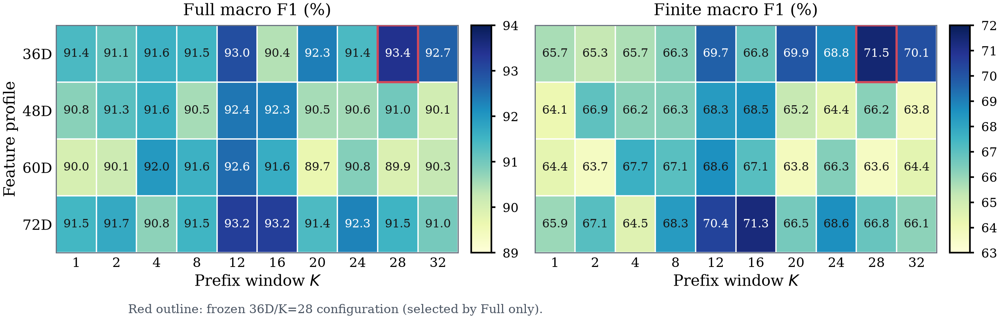
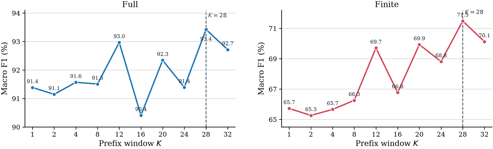
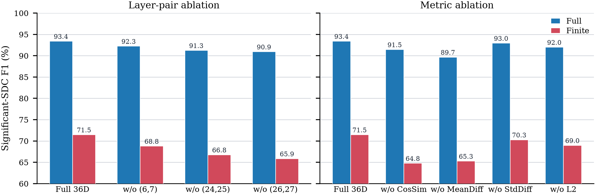
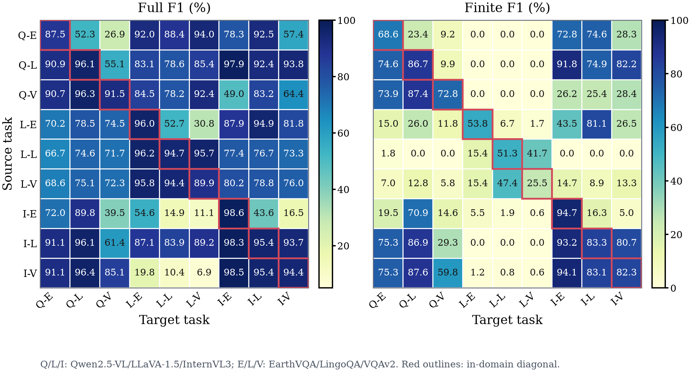

# SIEVE

[Detailed Experiment Handbook (中文)](experiments/README.md): protocols,
data lineage, commands, artifact schemas, results, and historical-version caveats.

## Final Results

**Nine-task Final-Test macro average, Significant-SDC as the positive class.**
`Full` is the primary evaluation cohort and the only basis for configuration
selection. `Finite` is a fixed diagnostic cohort: after freezing 36D/K=28,
every one of the 36 feature values must be finite.

| Cohort | Method | Precision | Recall | F1 | FPR |
| --- | --- | ---: | ---: | ---: | ---: |
| **Full** | Ranger-style | 82.33% | 87.40% | 83.46% | 0.95% |
| **Full** | Dr.DNA-style | 92.02% | 76.12% | 82.40% | 0.28% |
| **Full** | **SIEVE** | **96.38%** | **91.49%** | **93.78%** | **0.11%** |
| Finite | Ranger-style | 44.79% | 47.02% | 37.74% | 0.95% |
| Finite | Dr.DNA-style | 73.85% | 16.76% | 22.74% | 0.28% |
| Finite | SIEVE | 79.88% | 62.81% | 68.78% | 0.11% |

SIEVE improves Full macro F1 by **10.33 pp** over Ranger-style and
**11.38 pp** over Dr.DNA-style.

| Evaluation scope | Fixed setting |
| --- | --- |
| Tasks | 3 VLMs x 3 benchmarks: Qwen2.5-VL-7B, InternVL3-8B, LLaVA-1.5-7B x EarthVQA, LingoQA, VQAv2 |
| Per task | 5,000 clean executions and 50,000 random double-bit injected executions |
| Outer split | Group-disjoint Fit / Calibration / Final Test = 70% / 15% / 15% |
| Fault | One random activation double-bit flip at a `torch.nn.Linear` output during Prefill |
| Final monitor | Layer pairs `(6,7)`, `(24,25)`, `(26,27)`; 36D features; first `min(28, T)` decoding steps |

The complete per-task metrics are versioned in
[`experiments/comparison_36d_k28/results/`](experiments/comparison_36d_k28/results/)
and the nine-task macro averages in
[`summary`](experiments/comparison_36d_k28/results/summary_strict_finite/macro_average_metrics.csv).

## Configuration Selection

The final 36D/K=28 monitor is selected from 40 candidates
(`{36D, 48D, 60D, 72D} x K={1,2,4,8,12,16,20,24,28,32}`) using **only**
nine-task Full macro F1 inside the outer Fit partition. It reaches **93.42%**
Fit-only Full macro F1. Finite values are shown only after this choice is
frozen.

<p align="center">
  
</p>

<p align="center">
  
</p>

| Result artifact | Contents |
| --- | --- |
| [`configuration_ranking.csv`](experiments/fit_only_configuration_selection/configuration_ranking.csv) | Full-based ranking of all 40 candidates |
| [`macro_metrics.csv`](experiments/fit_only_configuration_selection/macro_metrics.csv) | Full macro metrics for every profile/window pair |
| [`task_metrics/`](experiments/fit_only_configuration_selection/task_metrics/) | Per-task Fit-only metrics |
| [`selection.json`](experiments/fit_only_configuration_selection/selection.json) | Frozen 36D/K=28 selection record |

## Component Ablation

Each leave-one-component-out run repeats Fit training and Calibration with the
same outer split. On the nine-task Full macro average, removing any layer pair
or metric family reduces F1.

<p align="center">
  
</p>

The figure source data and per-task values are available in
[`experiments/ablation_36d_k28_fit_only_strict_finite/`](experiments/ablation_36d_k28_fit_only_strict_finite/).

## Detector Transfer

For each source-to-target task pair, the source Detector and threshold are
frozen after source Fit/Calibration. The target contributes its own
fault-free Mapping telemetry only; target injected labels are not used for
training, tuning, or threshold selection.

<p align="center">
  
</p>

| Transfer result | Full F1 |
| --- | ---: |
| In-domain diagonal macro average | 93.78% |
| Cross-task off-diagonal macro average | 73.46% |

All F1, precision, recall, and FPR matrices are under
[`experiments/transfer_36d_k28/`](experiments/transfer_36d_k28/).

## Online Overhead

Forward-only benchmark on one NVIDIA H20, batch size 1, 50 fixed samples,
10 warmups, and 10 repeats (500 observations per model/method).

| Method | Mean latency overhead |
| --- | ---: |
| Ranger-style | 2.10% |
| Dr.DNA-style | 4.89% |
| SIEVE | 6.65% |

The per-model measurements are in
[`experiments/comparison_36d_k28/overhead_forward_r10/combined/`](experiments/comparison_36d_k28/overhead_forward_r10/combined/).

## Reproduce

```bash
python -m pip install -e '.[train,dev]'
PYTHONPATH=src python -m detect_sdc.cli config validate \
  configs/experiments/current.yaml
PYTHONPATH=src python -m pytest
```

| Study | Entry point | Result directory |
| --- | --- | --- |
| 36D/K=28 method comparison | [`scripts/run_comparison_36d_k28_all.sh`](scripts/run_comparison_36d_k28_all.sh) | [`comparison_36d_k28/`](experiments/comparison_36d_k28/) |
| Fit-only configuration selection | [`scripts/run_fit_only_configuration_selection.py`](scripts/run_fit_only_configuration_selection.py) | [`fit_only_configuration_selection/`](experiments/fit_only_configuration_selection/) |
| Component ablation | [`scripts/run_36d_k28_component_ablation.py`](scripts/run_36d_k28_component_ablation.py) | [`ablation_36d_k28_fit_only_strict_finite/`](experiments/ablation_36d_k28_fit_only_strict_finite/) |
| Detector transfer | [`scripts/evaluate_detector_transfer_36d_k28.py`](scripts/evaluate_detector_transfer_36d_k28.py) | [`transfer_36d_k28/`](experiments/transfer_36d_k28/) |
| Forward-only overhead | [`scripts/run_overhead_forward_r10.sh`](scripts/run_overhead_forward_r10.sh) | [`overhead_forward_r10/`](experiments/comparison_36d_k28/overhead_forward_r10/) |

Use model-specific environments in
[`reproducibility/environments/`](reproducibility/environments/) and set
dataset/model locations in `configs/models/*.yaml` and
`configs/datasets/*.yaml`. The complete execution protocol is in
[`docs/reproducibility.md`](docs/reproducibility.md).

## Artifact Policy

Versioned artifacts include paper figures, aggregate metrics, configuration
records, split manifests, and compact prediction files. Raw telemetry,
per-example feature tables, model checkpoints, and injected JSONL records are
kept local and ignored by
[`experiments/.gitignore`](experiments/.gitignore).

## License

No open-source license has been declared. Contact the authors before
redistributing code or generated artifacts.
