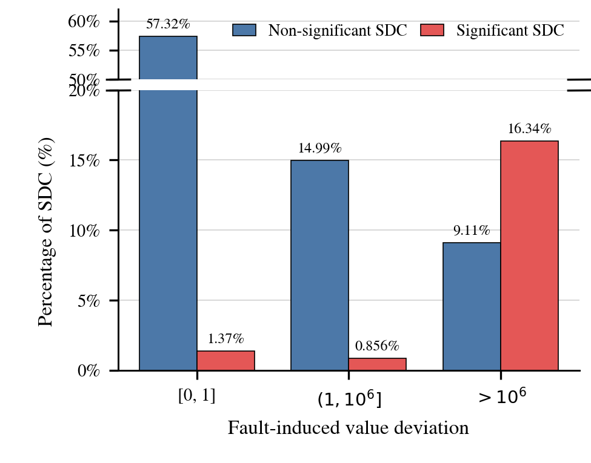

# 故障数值偏差分桶

[返回总手册](../README.md)

统计标量绝对偏差与 SDC 严重程度。最终三档图用全部有限 SDC 为统一分母，不用每桶自己的数量。



## 1. 偏差与区间

```text
delta = abs(fault.after - fault.before)
```

| 桶 | 精确范围 |
| --- | --- |
| `[0,1]` | 0 ≤ delta ≤ 1 |
| `(1,1e6]` | 1 < delta ≤ 1,000,000 |
| `>1e6` | delta > 1,000,000 |
| `non_finite` | before、after 或差值非有限 |

这是绝对偏差，不是相对误差或 ULP。边界 1 属于第一桶，1e6 属于第二桶。

## 2. 数据和计数

扫描九任务 labels 的所有 split，仅统计 injected。标签或 fault 数据无效的行单独统计并排除。

脚本维护两套计数：

- `counts`：全部有效 injected，分 Significant 和其他；其他包含 injected Non-SDC。
- `sdc_counts`：只保留答案改变的 SDC，分 significance=2 和 significance=0/1。

最终图使用第二套。`is_sdc_mismatches` 比较记录字段与答案改变判断，非零时需要调查。

## 3. 分母区别

| 文件族 | 分母 |
| --- | --- |
| 桶内统计 `*_buckets.csv` 中的桶内比例 | 当前桶数量 |
| `*_finite_global_shares.csv` | 所有有限 injected |
| `*_finite_sdc_global_shares.csv` | 所有有限且有效标注 SDC |

最终每个柱高 = `100 × 当前桶当前类别数量 / 所有有限 SDC 数量`。三桶两类合计为 100%，单桶的两类不要求合计 100%。

## 4. 当前结果

有效有限 SDC 总数 **68,468**：

| 桶 | SDC 数 | 全部 SDC 占比 | 显著数 | 显著全局占比 | 非显著数 | 非显著全局占比 |
| --- | ---: | ---: | ---: | ---: | ---: | ---: |
| `[0,1]` | 40,189 | 58.70% | 941 | 1.37% | 39,248 | 57.32% |
| `(1,1e6]` | 10,851 | 15.85% | 586 | 0.86% | 10,265 | 14.99% |
| `>1e6` | 17,428 | 25.45% | 11,188 | 16.34% | 6,240 | 9.11% |

来源：[aggregate_finite_sdc_global_shares.csv](aggregate_finite_sdc_global_shares.csv)。这是合并计数比例，不是九任务宏平均。

## 5. 产物

[summary.json](summary.json) 保存协议、逐任务桶计数和异常计数，是 `--reuse-summary` 的输入。

`deviation_buckets.csv` / `aggregate_buckets.csv` 包含 non-finite；`finite_deviation_buckets.csv` / `aggregate_finite_buckets.csv` 排除它。

`finite_global_shares.csv` 为有限 injected 的全局比例；`finite_sdc_global_shares.csv` 为有限 SDC 的全局比例。对应 aggregate 文件只保留合并范围。

非 aggregate 文件包含 `scope_type/scope`，区分 all/model/dataset/job；不要将多个 scope 混合求和而重复计数。

最终图是 `finite_sdc_global_share_by_deviation_bucket_broken_axis.png/.pdf`。断轴只影响视觉高度，不改变表格数值。

## 6. 重绘与重算

```bash
# 不扫描原始数据，但会重写当前目录的表和图。
PYTHONPATH=src:. python scripts/summarize_fault_deviation_buckets.py --reuse-summary
```

```bash
# 重新扫描本地 labels，不需 GPU。
PYTHONPATH=src:. python scripts/summarize_fault_deviation_buckets.py \
  --input-root experiments/telemetry_50 \
  --output-dir experiments/reproduced_deviation_buckets --workers 3
```

修改桶边界后，旧 summary 无法精确拆开原桶，需要原始 before/after 重新统计。

## 7. 限制

数值偏差与显著性的关联不是因果证明，也不是 Detector 检测率。该有限性条件与 36D Finite mask 不同，不能用本图分母解释主比较 F1。
