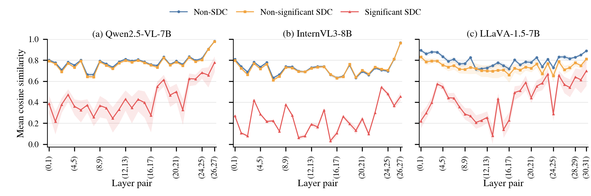

# 图 7：全部相邻层对、全部可观察 steps

[返回总手册](../README.md)

本实验描述 Calibration 中三类注入执行的层间指标分布。论文主图使用 LingoQA 三模型 CosSim，不是所有指标的拼图。

## 1. 样本与窗口

- 数据源：九任务 `telemetry_50/<job>/labels.jsonl`。
- 仅 Calibration，不使用 Final Test 描述这张图。
- 仅 injected execution，不包含 clean。
- 分组为 injected Non-SDC、Non-significant SDC、Significant SDC。
- 使用采集文件内全部可观察 steps，上限受 telemetry-50 限制，不保证等于完整无截断生成。
- Qwen/InternVL 有 27 个相邻层对，LLaVA 有 31 个。

先对每次执行、每个 pair 的可用 step 指标做均值，再跨执行统计。因此长输出不会仅因为 step 多就被当成更多个独立样本。

## 2. 指标

| CSV key | 统计对象 |
| --- | --- |
| `cos_sim` | Cosine similarity |
| `abs_mean_diff` | Mean Difference 的绝对值 |
| `abs_std_diff` | Std Difference 的绝对值 |
| `l2_distance` | L2 distance |

这些是用于可视化的执行级汇总，不是最终 Detector 的 36D mean/max/min 完整向量。其他指标的绝对值变换也不能不加说明地等同于模型训练输入。

## 3. 有限性和 CI

按 pair/metric 排除不可用数值并报告比例，而非统一删除所有 36D 有缺失的执行。同一个执行可出现在某 pair 的统计中而缺席另一 pair。

以 `semantic_group_id` 为 bootstrap 单位，10,000 次，seed=20260907，报告均值 95% CI。图像/问题内多次注入存在相关性，不能按单行独立重采样。

CI 反映均值估计不确定性，不是数据分布的 95% 范围。两类均值分离也不能直接转换为 Detector F1。

## 4. 文件与字段

| 文件 | 内容 |
| --- | --- |
| [protocol.json](protocol.json) | 每任务输入 SHA-256、行数、排除数、类别数和层对数 |
| [all9_pair_statistics.csv](all9_pair_statistics.csv) | 九任务 CosSim 明细 |
| [all9_all_metric_statistics.csv](all9_all_metric_statistics.csv) | 九任务四指标明细 |
| [figure7_lingoqa_all_pairs_all.csv](figure7_lingoqa_all_pairs_all.csv) | 当前主图数据 |
| `figure7_lingoqa_all_pairs_all.png/.pdf` | 三模型 LingoQA CosSim 图 |
| `figure7_lingoqa_all_metrics_all.csv/.png/.pdf` | 四指标补充结果 |
| [macro_pair_statistics.csv](macro_pair_statistics.csv) | 已保存的跨任务统计 |
| [non_finite_rates.csv](non_finite_rates.csv) | 无效值率 |

明细字段包括 `job/model/dataset/metric/src_layer/tgt_layer/sdc_group`、`rows`、`semantic_groups`、`finite_rows`、`non_finite_rows`、`non_finite_rate`、`mean_value`、`median_value`、`std_value`、`q25_value/q75_value`、`mean_ci95_low/high`、`evidence`。

`rows` 是该组执行数，不是独立 group 数；`finite_rows` 是实际参与该指标均值的数量。检查小样本组时应同时看二者。

## 5. 可复现范围

当前仓库保存统计表和 protocol，但**没有保留产生此九任务 Calibration group-bootstrap 成套产物的专用批处理入口**。

现存 `scripts/plot_sdc_cosine_by_layer_pair.py` 是较早的单文件 CosSim 绘图工具，不能未经修改就声称精确复现这里的 Calibration 分组、三类标签及 group-bootstrap CI。

因此这里不提供虚构的一键重跑命令。只查看表和现有图不需要原始 JSONL；精确重建需要依据 protocol 补齐生成器，并使用相同输入 hash、分组和有限性策略。

重建步骤应为：读取 Calibration injected -> 验证标签 -> 每执行每 pair 的有限 step 均值 -> 类别统计 -> group bootstrap -> 输出 CSV -> 绘图。不能将所有 step 直接平铺后计算均值或 CI。

## 6. 版式与解释

主图设计尺寸为 6.75×2.25 in，英文标签。不要将三模型全层对图与最终仅三个 pair 的 Detector 监控配置混淆。

Qwen/LingoQA 示例 `(0,1)` 的 Significant SDC 行数为 264、有限行为 216、无效行为 48；均值基于有限行。忽略这 48 行会使读者错误理解样本支持度。

历史前四步版本见 [feature_visualization_k4_all_pairs](../feature_visualization_k4_all_pairs/README.md)。主文引用应使用当前 all-steps CosSim，除非明确讨论窗口差异。
