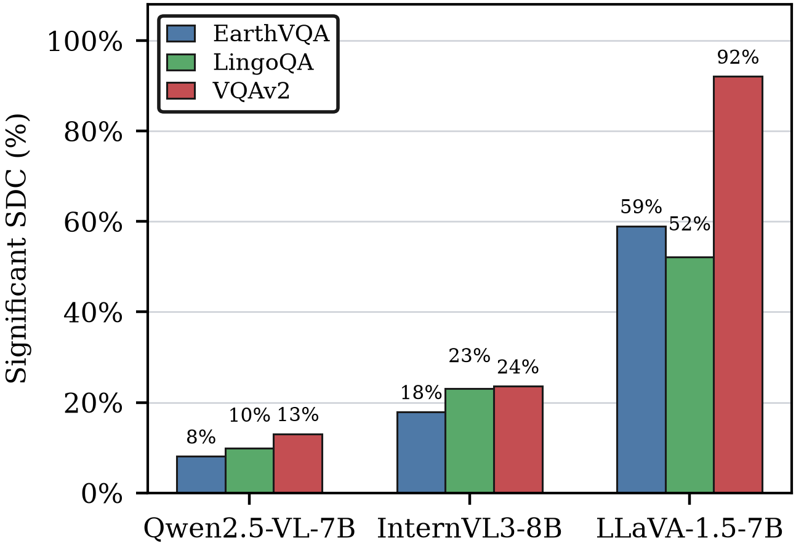

# 图 2：SDC 中 Significant SDC 的占比

[返回总手册](../README.md)

本图回答“已经发生的 SDC 有多少是显著的”，不是检测召回率，也不是所有注入中发生 SDC 的概率。



## 1. 当前统计口径

扫描九任务 `telemetry_50/<job>/labels.jsonl`：

1. 仅保留 injected execution。
2. 用 `pred_answer != clean_answer` 判断答案改变。
3. 要求 `fault.before` 和 `fault.after` 都能解析且有限。
4. 要求 significance 有效且属于 0/1/2。
5. significance=2 为分子；所有保留 SDC 为分母。

```text
Significant share = Significant SDC / (Non-significant SDC + Significant SDC)
```

覆盖 Fit/Calibration/Test，是故障结果描述统计，不是 Final Test Detector 性能。clean 和 injected Non-SDC 不在分母中。

## 2. 有限性

这里只检查注入前后标量，不检查完整 36D 特征，因此不同于主比较 Finite。

本脚本不额外要求差值有限，偏差分桶脚本会检查差值。有限两端相减溢出的极端情况下，两种统计可以有不同有效数量。

## 3. 文件与字段

| 文件 | 含义 |
| --- | --- |
| [significant_sdc_among_finite_value_sdc.csv](significant_sdc_among_finite_value_sdc.csv) | 当前九任务统计 |
| `significant_sdc_among_finite_value_sdc.png/.pdf` | 当前图 |
| `significant_sdc_among_all_sdc.csv/.png/.pdf` | 历史未采用当前有限标量过滤版本 |

`injected_executions` 是扫描注入数，`finite_value_sdc_labeled` 才是图的分母。`significant_sdc` 和 `non_significant_sdc` 为两类计数。

`non_finite_value_sdc` 记录标量非有限，`invalid_fault_sdc` 记录故障元数据无效，`unlabeled_finite_value_sdc` 记录标签无效。`significant_share_among_finite_value_sdc_percent` 已乘 100。

例如 Qwen/EarthVQA 为 982/12,133=8.09%，不是 982/50,000。

## 4. 只重绘

```bash
PYTHONPATH=src:. python scripts/plot_significant_sdc_among_sdc.py --reuse-csv
```

只需要已提交 CSV 和绘图库，不扫描 JSONL；会更新当前图。设计宽度 3.25 in，PNG 400 DPI，同时输出 PDF。

## 5. 重新扫描

```bash
PYTHONPATH=src:. python scripts/plot_significant_sdc_among_sdc.py \
  --input-root experiments/telemetry_50 \
  --output-dir experiments/reproduced_figure2 --workers 3
```

需要九份本地 labels，大量 I/O，但不需要 GPU 或新注入。

## 6. 解读限制

高占比不意味着模型更容易发生 SDC：某模型可能极少发生 SDC，但一旦发生便多为显著。跨模型风险还需要报告发生率等其他分母。

本图没有使用 Detector 预测，不能证明检测有效。Judge 标签也不能在没有人工审计时称为人工金标准。
